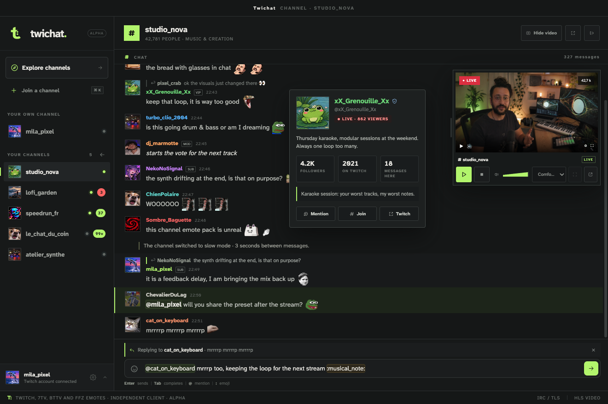

<div align="center">


# Twichat

**A room with the TV on.**



</div>

A desktop Twitch client where chat takes the window. Avatars, badges and emotes show in full, replies form threads, and the stream sits beside them in a player you resize. Up to twenty channels open at once, without the noise of a browser.

## Features

- **Full-width chat**, with a floating video player you can show, hide or resize.
- **Detachable video**: move the player into its own window, resize it on the stream's own ratio, pin it above your other windows. It keeps following the room (same channel, same controls, same stops), and the choice is saved per account, in the settings or from the dock.
- **Twitch, 7TV, BetterTTV and FFZ emotes** rendered natively in the chat.
- Nested **reply threads** and highlighted **mentions**.
- **Multiple accounts**: automatic reconnection to the last account used, or anonymous viewing.
- **Live stats** (viewers, uptime) and an explorer for the channels you follow.
- **Light and dark themes.**
- **macOS, Windows and Linux** apps.

## Getting started

Requirements: Node.js 22.12 or newer (what Electron 44 and Vite 7 ask for). Nothing else — the video resolves the channel's public HLS playlist itself.

```sh
npm install
npm run dev
```

With no active session, Twichat offers to resume an account already used, connect another one, or carry on anonymously. A deliberate sign-out keeps the encrypted account but suspends automatic reconnection.

## Updates

A `v*` tag builds the four installers and publishes them as a GitHub release. The app checks that
release half a minute after launch, then every six hours, and says so on one line of the status bar.

Windows updates itself: the NSIS installer electron-updater drives needs no signature, so the build
downloads in the background and the line offers the restart that applies it. macOS and Linux are told
rather than updated, and the line opens the release page instead. Squirrel.Mac verifies the code
signature of what it downloads and these builds carry none; deb and rpm belong to the system's package
manager. Signing the macOS build is what would close that half.

The tag and the `version` field of `package.json` have to match: that field is what the running app
compares against the release. `scripts/release-gate.mjs` enforces it — it runs before anything is
installed, so a tag ahead of the file costs seconds instead of three packaging jobs and a release
whose installers announce a version that was never cut.

The installers are built under fixed names — `Twichat-mac.dmg`, `Twichat-windows.exe`,
`Twichat-linux.deb`, `Twichat-linux.rpm` — rather than the versioned ones electron-builder writes
by default. Two things depend on that. The site serves those exact names from `/download`, and
GitHub keeps a permanent address per name:

    https://github.com/theslumdogemillionaire/twichat/releases/latest/download/Twichat-mac.dmg

And `latest*.yml`, the file the in-app check reads, names the installer by its file name and
carries its checksum — so the name has to come from the build rather than from a rename after it,
or that metadata points at a file the release does not hold. A test compares the names the site
promises against the ones `electron-builder.yml` builds.

Each release also carries `SHA256SUMS.txt`, listing the four installers under those same names.

A failed check is never shown: the version in hand keeps working. It is written to the log, so a
month of silent failures does not look like a month without a release.

## Landing site

The repository also holds the landing site (`server/index.mjs`, `npm run site`): the presentation page and the Twitch sign-in (OAuth). Configured through `.env`, see [`.env.example`](.env.example).

### In a container

The site is the only piece that containerizes: `server/app.mjs` imports nothing but built-in Node modules, so the image is Node plus the site's files: no dependency install, no build step. The desktop app stays outside the container: an Electron binary is built with electron-builder and has no useful shape here.

```sh
cp .env.example .env   # then fill in PUBLIC_ORIGIN and the Twitch keys
docker compose up -d
```

The site then answers on http://127.0.0.1:3000. `PORT` picks the host port (`PORT=8080 docker compose up -d`); the container keeps its own.

What a busy host port does depends on the daemon. Measured here, on Docker Desktop for macOS: the `up` succeeds, `docker compose ps` reports `Up (healthy)` and lists the mapping, and yet nothing answers on the host — the health probe runs inside the container and knows nothing of the publication. So the check worth trusting is a request from the host rather than the status column:

```sh
curl -fsS "http://127.0.0.1:${PORT:-3000}/healthz"
```

The container is meant for development: `server/` is mounted, so editing a file is enough, with no rebuild. Static assets are served straight from disk, and a small supervisor ([`scripts/dev-server.mjs`](scripts/dev-server.mjs)) restarts the server when anything under `server/` changes, which the pages held in memory need. It polls modification times rather than using `node --watch`. On Docker Desktop the host files reach the container through a virtual machine, and inotify events do not cross that boundary: an event-based watcher installs itself and never fires. On a Linux host the events do arrive — same kernel, same filesystem — but polling costs one `stat` per file per interval and works on both, so it is the single path kept.

`PUBLIC_ORIGIN` carries the public URL: it builds the canonicals, the `hreflang`, the `sitemap.xml` and the OAuth `redirect_uri`, so the Twitch console must declare `<PUBLIC_ORIGIN>/auth/callback`. The installers `/download` serves live in `server/public/downloads/`, mounted read-only: the server looks the file up on each request, so dropping one there is enough — no rebuild, no watcher, no restart.

## Tests

```sh
npm test          # unit tests
npm run typecheck
npm run site:check     # site routes, alternates and structured data
npm run site:test:ui   # screenshot band, theme filtering, lightbox, keyboard and responsive layout (installed Chrome)
npm run test:locale    # system language, hydration, hot switch, per-account persistence
npm run test:settings  # playback settings and per-account scoping
npm run test:detach    # detached video window, reattaching, remembered size
```

## Icons and logo

`build/icon.png` is the master: a single 512×512 PNG. There is no vector source in the repository — that PNG is what you edit or replace. It is copied byte for byte to `src/renderer/public/twichat-logo.png` for the app and to `server/public/assets/twichat-logo.png` for the site, because three builds read it from three places. The light-theme variant has its own master, `src/renderer/public/twichat-logo-light.png`, copied to the site the same way.

```sh
npm run icons             # checks every copy against its master
npm run icons -- --write  # copies the masters over them
```

`icon.icns` and `icon.ico` are not committed: electron-builder derives them from `build/icon.png` while packaging, so replacing that one file changes the app icon on all three platforms.

## Tech stack

Electron + Vite + TypeScript. The chat and the emote rendering are in-house; only `hls.js` handles the video.

## Status

Alpha, and the word is meant literally: version 0.1.0, no release published yet, an interface
still moving. Concretely, what has and has not been verified:

- **macOS on Apple Silicon** is where the app is built, packaged and driven by the smoke scripts.
  That is the platform with evidence behind it.
- **Windows and Linux** packages are built locally and by CI on a tag, but no tag has been cut
  yet and nobody has installed one. Treat them as untested rather than broken.
- **The macOS package is built universal**, so it carries both Apple Silicon and Intel. Only the
  Apple Silicon half has been run.
- **No release has been published**, so the update path itself — a version replacing the one
  before it, and the data surviving it — has never been exercised end to end.
- **Builds are unsigned.** macOS shows the unidentified-developer warning, Windows shows
  SmartScreen. See Troubleshooting.

## Licences and privacy

[LICENSE](LICENSE) covers the code. [NOTICE.md](NOTICE.md) covers what it does not: the Atkinson
Hyperlegible font under the SIL OFL, the three runtime dependencies, and the real Twitch, 7TV,
BetterTTV and FrankerFaceZ emotes baked into the landing site's screenshots — those screenshots are
staged, and the file says exactly how.

[PRIVACY.md](PRIVACY.md) lists what the application stores, every host it talks to and why, what
the sign-in server holds and for how long, and how to erase all of it. There is no telemetry of any
kind; that document is where to check the claim rather than take it.

## Troubleshooting

**macOS refuses to open the app.** The build carries no signature. Right-click the app and choose
*Open*, or allow it in System Settings → Privacy & Security after the first refusal.

**Windows blocks the installer.** SmartScreen, same cause: *More info*, then *Run anyway*.

**The browser sign-in never comes back to the app.** The `twichat://` link is handed back by the
operating system, and that association is installed with the app — so it works from an installed
build, and may not from a copy run out of the source tree. The account dialog also accepts a token
pasted by hand.

**"Secure storage unavailable", and the account is not remembered.** Tokens are enciphered by the
system keychain, and the app refuses to write one in the clear. On Linux that means a keyring must
be running (`gnome-keyring`, `kwallet`); without one, Twichat still runs, but every launch starts
signed out.

**The session expires again and again.** A revoked token cannot be renewed — signing in once more
is the only path. If it happens within minutes each time, that is a bug: please report it.

**The video does not start.** The status line names which of the three it is: the channel is
offline, the stream is reserved (subscribers only), or it is not served in your country. Chat keeps
working in all three cases.

**Removing what Twichat stored.** Everything lives in one directory —
`~/Library/Application Support/Twichat` on macOS, `%APPDATA%\Twichat` on Windows,
`~/.config/Twichat` on Linux. `twichat.db` holds the preferences and rooms, `accounts.json` the
enciphered tokens, `avatars.json` the cached profile pictures. Deleting the directory resets the
app completely.

## Contributing

[CONTRIBUTING.md](CONTRIBUTING.md) covers the setup, the two kinds of test and the conventions.
[ARCHITECTURE.md](ARCHITECTURE.md) explains how the pieces fit. Security reports go through
[SECURITY.md](SECURITY.md), never a public issue.

## License

MIT, see [LICENSE](LICENSE).
